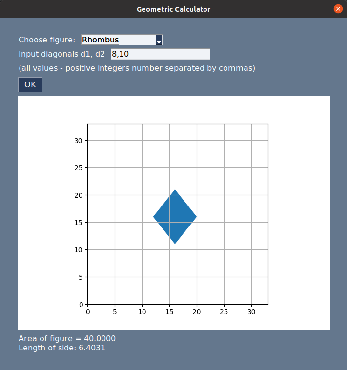
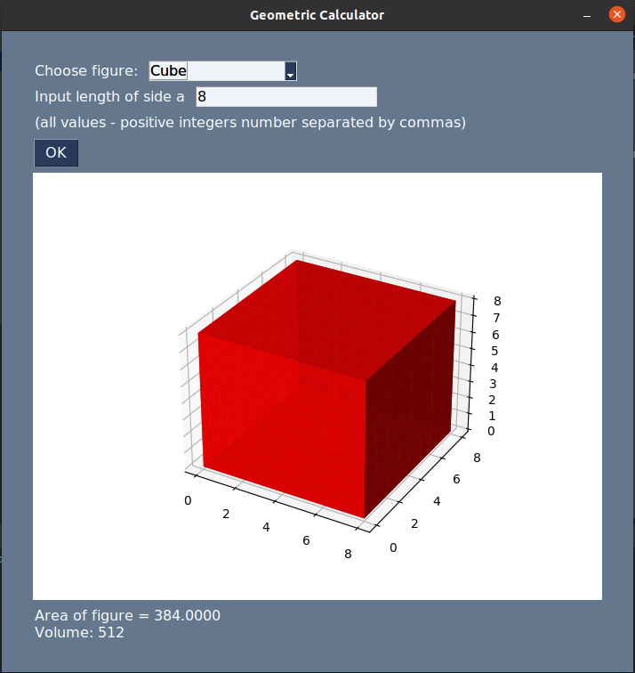
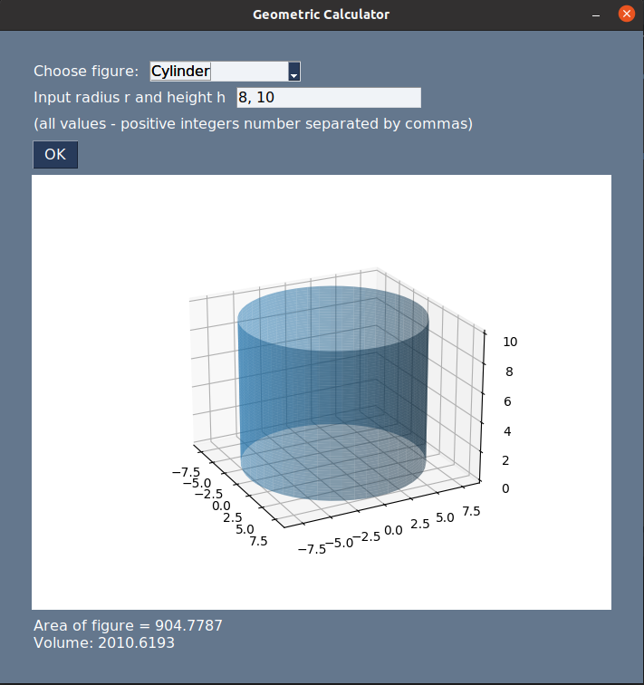

# Geometric Calculator

This application allows to calculate simple operation on geometric figures: find out area, volume and some specific properties for different 2D and 3D figures: hypotenuse for triangle, length of trapezoid's middle line etc.

Also it shows figure's representation.

It's use PySimpleGUI as base GUI library, matplotlib as library for drawing figures and numpy library for several geometric calculations.

## List of figures:
1) Rectangle
2) Circle
3) Square
4) Triangle
5) Rhombus
6) Trapezoid
7) Sphere
8) Cube
9) Parallelepiped
10) Pyramid
11) Cone

    

